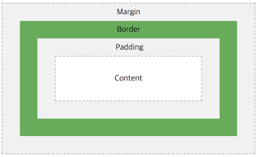
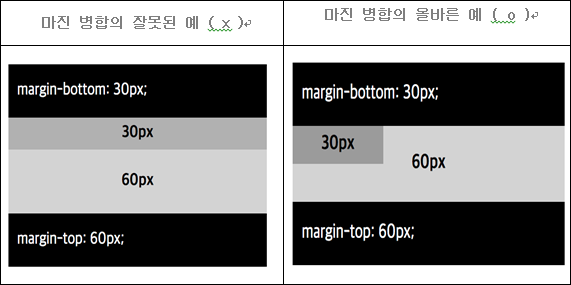
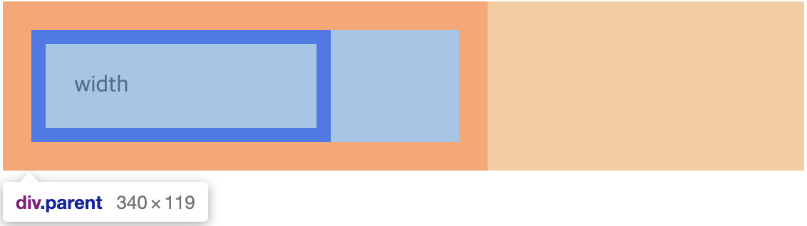
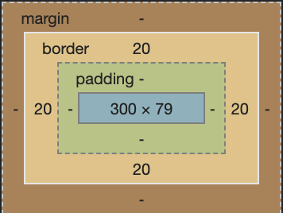
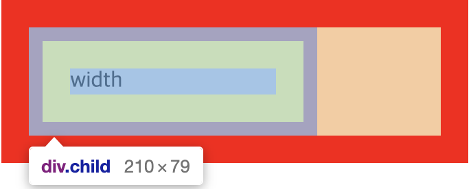
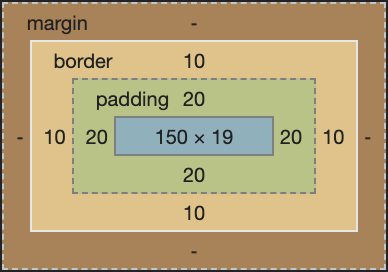

# BOX MODEL

- BOX MODEL

    HTML의 모든 요소는 사각형의 박스 형태로 만들어집니다.
    박스는 총 4가지의 세분된 영역으로 구성되어있으며 영역마다 다양한 스타일을 적용할 수 있습니다.
    이 4가지 영역을 통틀어서 박스 모델(BOX MODEL)이라고 합니다.

    문서를 배치할 때 브라우저의 렌더링 엔진은 표준 CSS 기본 박스 모델에 따라 각 요소를 사각형 상자로 나타냅니다.
    CSS를 이용해 이 상자의 크기, 위치 및 속성(색상, 배경, 테두리 크기 등)을 변경할 수 있습니다.

    ### BOX MODEL의 구성

    

    ### Content 영역

    요소의 실제 내용을 포함하는 영역입니다. 따라서 크기는 내용의 너비 및 높이를 나타냅니다.

    ### Padding 영역

    content 영역과 테두리 사이의 여백을 padding이라고 합니다.
    content 영역이 배경, 색 또는 이미지가 있을 때 padding 영역까지 영향을 미칩니다.
    이에 따라 padding을 content의 연장으로 볼 수도 있습니다.

    ### Boarder 영역

    content 영역을 감싸는 테두리 선을 border라고 합니다.

    ### Margin 영역

    border 바깥쪽의 영역을 margin 이라고 합니다.
    border 영역을 다른 요소와 구별하기 위해 쓰이는 빈 영역입니다.
    즉, 주변 요소와의 여백(간격)을 margin을 이용해 지정할 수 있습니다.

    ---

    ### 실습 코드

    ```html
    <!DOCTYPE html>
    <html lang="ko">
    	<head>
    		<meta charset="UTF-8">
    		<title>BOX MODEL</title>
    		<style>
    			div {
    				border: 10px solid #000000;
    				padding: 20px;
    				margin: 30px;
    			}
    		</style>
    	</head>
    	<body>
    		<div>BOX MODEL</div>
    	</body>
    </html>
    ```

    ---

    ### 참고자료

    [Introduction to the CSS basic box model](https://developer.mozilla.org/en-US/docs/Web/CSS/CSS_Box_Model/Introduction_to_the_CSS_box_model)

    [The box model](https://developer.mozilla.org/en-US/docs/Learn/CSS/Building_blocks/The_box_model)

    [CSS Box Model](https://www.w3schools.com/css/css_boxmodel.asp)

- border

    border 속성은 요소의 테두리에 관련된 속성을 지정할 때 사용합니다.
    테두리의 굵기, 모양, 색상을 지정할 수 있는 속성들이 있으며, 앞서 배웠던 background 속성처럼 여러 속성을 축약하여 적용할 수도 있습니다.

    ### border 관련 속성

    ### border-width (default=medium)

    선의 굵기를 지정하는 속성입니다.
    border-top-width, border-bottom-width, border-left-width, border-right-width를 이용하여 상, 우, 하, 좌의 선의 굵기를 다르게 표현할 수 있습니다.

    ```css
    border-width: [top][right][bottom][left];
    ```

    속성 값으로 단위와 키워드를 사용할 수 있습니다.

    - 단위 : px, em, rem, ... (%, 정수 단위 사용불가)
    - 키워드 : thin, medium, thick

    ### border-style (default=none)

    선의 모양을 지정하는 속성입니다.
    border-top-style, border-bottom-style, border-left-style, border-right-style을 이용하여 상, 우, 하, 좌의 선의 모양을 다르게 표현할 수 있습니다.

    ```css
    border-style: [top][right][bottom][left];
    ```

    또한, 위처럼 축약하여 공백을 이용해 각 방향에 대한 스타일을 지정할 수도 있습니다.

    - none : border를 표시 하지 않습니다.
    - sollid : border를 실선 모양으로 나타냅니다.
    - double : border를 이중 실선 모양으로 나타냅니다.
    - dotted : border를 점선 모양으로 나타냅니다.

    그 밖에도 dashed, double, groove, ridge, inset, outset 등의 다양한 스타일이 있습니다.

    ### border-color (default=currentColor)

    선의 색상을 지정하는 속성입니다.
    border-top-color, border-bottom-color, border-left-color, border-right-color를 이용하여 상, 우, 하, 좌의 선의 색상을 다르게 표현할 수 있습니다.

    ```css
    border-color: [top][right][bottom][left];
    ```

    또한, 위처럼 축약하여 공백을 이용해 각 방향에 대한 색상을 지정할 수도 있습니다.
    색상을 일반적인 CSS 색상 값 사용 방식과 같습니다.

    ### border 축약

    ```css
    border: [-width][-style][-color];
    ```

    위와 같이 공백으로 구분해 축약하여 사용할 수 있고, 정의되지 않은 속성값에 대해서는 기본값이 적용됩니다.

    ---

    ### 실습 코드

    ```css
    /* 속성 */
    border-width: 1px; /* 두께 <length> | thin | medium | thick */
    border-style: solid; /* 종류 none | hidden | dotted | dashed | solid | double | groove | ridge | inset | outset */
    border-color: #000; /* 색상 */

    /* 축약형 */
    border: 1px solid #000; /* 단축 속성 */
    border-left: 6px solid red; /* 보더 왼쪽 */
    border-width: 6px; /* 보더 두께 */
    border-width: 6px 3px; /* 보더 상하, 좌우 두께 */
    border-width: 6px 3px 4px /* 보더 상, 우(좌), 하 두께 */
    border-width: 6px 3px 4px 1px /* 보더 상, 우, 하, 좌 두께 */
    ```

    ```html
    <!DOCTYPE html>
    <html lang="ko">
    	<head>
    		<meta charset="UTF-8">
    		<title>border</title>
    		<style>
    			div {
    				border-width: 10px;
    				border-style: solid;
    				border-color: #000;
    				
    				/* 축약형 */
    				border: 10px solid #000;
    			}
    		</style>
    	</head>
    	<body>
    		<div>border property</div>
    	</body>
    </html>
    ```

    ---

    ### 참고자료

    [- CSS: Cascading Style Sheets | MDN](https://developer.mozilla.org/en-US/docs/Web/CSS/color_value#currentcolor_keyword)

    [border](https://developer.mozilla.org/en-US/docs/Web/CSS/border)

    [CSS Borders](https://www.w3schools.com/css/css_border.asp)

- padding

    padding 영역은 border와 content 사이의 여백을 말합니다.

    ### padding 관련 속성

    padding의 기본값은 0이며, 속성 값으로 길이 단위인 length, 요소의 width에 상대적인 크기인 percent, initial, inherit으로 선언할 수 있습니다. (음수 값은 허용되지 않습니다.)
    요소 각 면에 padding을 지정하는 속성으로 padding-top, padding-right, padding-bottom, padding-left가 있습니다.

    ```css
    padding: length|percent|initial|inherit;
    ```

    ### padding-top

    content 영역의 위쪽 여백을 지정합니다.

    ```css
    padding-top: 0;
    ```

    ### padding-right

    content 영역의 오른쪽 여백을 지정합니다.

    ```css
    padding-right: 10px;
    ```

    ### padding-bottom

    content 영역의 아래쪽 여백을 지정합니다.

    ```css
    padding-bottom: 20%;
    ```

    ### padding-left

    content 영역의 왼쪽 여백을 지정합니다.

    ```css
    padding-left: 30px;
    ```

    padding-top,right,bottom,left를 사용하여 요소 네면 모두에 대해 다른 padding 값을 설정할 수 있습니다.

    ### padding 축약

    ```css
    padding: [-top][-right][-bottom][-left];
    ```

    기본적으로 padding의 4가지 속성을 위와 같이 축약하여 사용할 수 있습니다.
    속성의 순서는 상, 우, 하, 좌 순으로 고정되어 있으며 위쪽을 기준으로 시계방향으로 선언합니다.

    축약형으로 사용할 때 반드시 4개의 속성에 대한 값을 모두 적어야 하는 것은 아니며 속성 값으로 1~4개의 값을 사용할 수 있으며 border에서는 축약형 사용 시 정의되지 않은 속성값에 대해서 기본값이 적용되었지만, padding은 조금 다른 방식으로 동작합니다.
    그 이유로 상하, 좌우 영역의 값이 같은 경우 하나로 합쳐서 적용할 수 있기 때문입니다.

    ```css
    /* 상,우,하,좌 네 면의 값이 모두 다른 경우 */
    padding: 10px 20px 30px 40px;
    /* 좌,우 값이 같고 상,하 값이 다른 경우 */
    padding: 10px 20px 30px; /* 좌,우의 값은 20px */
    /* 상,하 값이 같고 좌,우 값이 같은 경우 */
    padding: 10px 20px; /* 상,하의 값은 10px 좌,우 동일하게 20px */
    /* 상,우,하,좌 값이 모두 같은 경우 */
    padding: 10px; /* 상,우,하,좌의 값은 10px */
    ```

    참고로 CSS에서 0 값에 대해서는 단위를 따로 적지 않습니다.

    ---

    ### 실습 코드

    ```html
    <!DOCTYPE html>
    <html lang="ko">
    	<head>
    		<meta charset="UTF-8">
    		<title>padding</title>
    		<style>
    			div {
    				padding-top: 10px;
    				padding-right: 20px;
    				padding-bottom: 30px;
    				padding-left: 40px;
    				
    				/* 축약형 */
    				border: 10px 20px 30px 40px;
    			}
    		</style>
    	</head>
    	<body>
    		<div>padding property</div>
    	</body>
    </html>
    ```

    ---

    ### 참고자료

    [padding](https://developer.mozilla.org/en-US/docs/Web/CSS/padding)

    [CSS Padding](https://www.w3schools.com/css/css_padding.asp)

- margin

    margin 영역은 border 영역을 다른 요소와 구별하기 위해 쓰이는 빈 영역입니다.
    즉, 이 말은 다른 요소와의 간격을 만들 수 있다는 것을 뜻합니다.

    ### margin 관련 속성

    margin의 기본값은 0이며, 속성 값으로 길이의 단위인 length, initial, inherit을 선언할 수 있으며, padding과 다르게 auto 값을 선언할 수 있습니다. (padding과 달리 음수 값을 지정할 수 있습니다.)

    요소 각 면에 margin을 지정하는 속성으로 margin-top, margin-right, margin-bottom, margin-left가 있습니다.

    ```css
    margin: length|percent|auto|initial|inherit;
    ```

    auto의 경우 브라우저에 의해 계산된 값이 적용 됩니다.

    ### margin-top

    border 영역의 위쪽 여백을 지정합니다.

    ```css
    margin-top: 0;
    ```

    ### margin-right

    border 영역의 오른쪽 여백을 지정합니다.

    ```css
    margin-right: 10px;
    ```

    ### margin-bottom

    border 영역의 아래쪽 여백을 지정합니다.

    ```css
    margin-bottom: 20%;
    ```

    ### margin-left

    border 영역의 왼쪽 여백을 지정합니다.

    ```css
    margin-left: 30px;
    ```

    margin-top,right,bottom,left를 사용하여 요소 네면 모두에 대해 다른 margin 값을 설정할 수 있습니다.

    ### margin 축약

    ```css
    margin: [-top][-right][-bottom][-left]
    ```

    기본적으로 margin의 4가지 속성을 위와 같이 축약하여 사용할 수 있습니다.
    속성의 순서는 상, 우, 하, 좌 순으로 고정되어 있으며 위쪽을 기준으로 시계방향으로 선언합니다.

    ```css
    /* 상,우,하,좌 네 면의 값이 모두 다른 경우 */
    margin: 10px 20px 30px 40px;
    /* 좌,우 값이 같고 상,하 값이 다른 경우 */
    margin: 10px 20px 30px; /* 좌,우의 값은 20px */
    /* 상,하 값이 같고 좌,우 값이 같은 경우 */
    margin: 10px 20px; /* 상,하의 값은 10px 좌,우 동일하게 20px */
    /* 상,우,하,좌 값이 모두 같은 경우 */
    margin: auto; /* 상,우,하,좌의 값은 auto */
    ```

    padding과 마찬가지로 축약하여 사용할 수 있고 상하, 좌우에 대해서 값이 같으면 하나로 합하여 사용할 수 있습니다.
    margin에서는 수치 이외에 사용할 수 있는 auto 값이 있습니다.

    ### margin auto

    기본적으로 브라우저에 의해 계산이 이루어지는데, 대부분의 경우 0(기본값) 또는 요소의 해당 측면에서 사용 가능한 공간과 같은 값을 가집니다.
    이를 활용하여 수평 중앙 정렬을 할 수 있습니다.

    ```css
    margin-left: auto;
    margin-right: auto;
    ```

    좌우의 margin이 모두 auto로 적용 되었다면, 브라우저는 요소가 가질 수 있는 가로 영역에서 자신의 width를 제외한 나머지 여백의 크기에 대해 균등 분할하여 적용합니다.

    주의할 점은 수평 중앙 정렬을 하는 경우 width를 갖고 있는 요소에만 적용을 할 수 있다는 점입니다.
    만약 width 값이 없는 요소에 적용할 경우 아무런 기능을 할 수 없습니다.
    왜냐하면 브라우저가 정렬을 시켜주려면 width 값이 필요한데 width 값이 없는 경우 어떤 것을 기준으로 어떻게 정렬을 시켜줘야 할 지 알 수 없기 때문입니다.
    때문에 요소의 width 값이 반드시 필요하다는 점을 알고있어야 합니다. 

    상하의 경우 수직 중앙 정렬이 되지 않으며, 기본적인 flow의 박스 형태의 나열을 벗어나는 상황에 대해서 적용이 됩니다. 이는 조금 더 심화적인 개념이 필요하므로 기초에서는 수평 정렬에 대한 개념을 확실히 알고 넘어가도록 합니다.

    ### margin collapse (마진 병합)

    마진 병합은 인접한 두 개 이상의 수직 방향 박스의 마진이 하나로 합쳐지는 것을 의미합니다.
    마진 병합은 다음 세 가지 경우에 일어납니다.

    1. 두 요소가 상하로 인접한 경우 : 위 요소의 하단 마진과 아래 요소의 상단 마진의 병합이 일어납니다.
    2. 부모 요소와 첫 번째 자식 요소 또는 마지막 자식 요소
    2-1. 부모 요소의 상단 마진과 첫 번째 자식 요소의 상단 마진 병합이 일어납니다.
    2-2. 부모 요소의 하단 마진과 마지막 자식 요소의 하단 마진 병합이 일어납니다.
    3. 내용이 없는 빈 요소의 경우 : 해당 요소의 상단 마진과 하단 마진의 병합이 일어납니다.

    마진 병합은 수직 방향으로만 이루어지며, 좌우에 대해서는 일어나지 않습니다.
    마진 병합은 마진이 반드시 맞닿아야 발생하기 때문에 2, 3번째의 경우 패딩 및 보더가 없어야 합니다.

    

    마진 병합을 활용하여 첫 번째와 두 번째 컴포넌트의 조합이 다양한 경우 여백을 다르게 사용할 수 있습니다.

    margin collapse는 절대 위치나 상대 위치가 주어진 요소들에서는 발생하지 않습니다.

    ---

    ### 실습 코드

    ```html
    <!DOCTYPE html>
    <html lang="ko">
    	<head>
    		<meta charset="UTF-8">
    		<title>margin</title>
    		<style>
    			div {
    				margin-top: 10px;
    				margin-right: 20px;
    				margin-bottom: 30px;
    				margin-left: 40px;
    				
    				/* 축약형 */
    				margin: 10px 20px 30px 40px;
    			}
    		</style>
    	</head>
    	<body>
    		<div>margin property</div>
    	</body>
    </html>
    ```

    ---

    ### 참고자료

    [margin](https://developer.mozilla.org/en-US/docs/Web/CSS/margin)

    [CSS Margin](https://www.w3schools.com/css/css_margin.asp)

    [Mastering margin collapsing](https://developer.mozilla.org/en-US/docs/Web/CSS/CSS_Box_Model/Mastering_margin_collapsing)

    [CSS Margin Collapse](https://www.w3schools.com/css/css_margin_collapse.asp)

- padding & margin

    padding과 margin 두 속성 모두 여백을 선언할때 적용하는 속성입니다.
    그러나, border의 경계가 명확하게 표시되지 않으면 어떤 속성으로 필요한 여백을 표현할지 헷갈릴 수 있습니다.
    이럴 경우 자신이 원하는 속성을 이용해서 여백을 표현하여도 상관은 없지만, 엄연히 다른 속성이기 때문에 두 속성의 차이를 명확히 알고 사용하는 것이 좋습니다.

    ### paddng과 margin의 비교

    ```
             양수  음수  auto      단위
    padding   O    X    X    px, %, ...
    margin    O    O    O    px, %, ...
    ```

    ### % 값의 사용과 기준점

    px과 같은 고정적인 단위 외에도 %라는 상대적인 단위를 사용할 수 있습니다.
    %는 요소의 크기를 기준으로 상대적인 값을 결정짓게 됩니다.
    일반적으로 생각했을 때 상, 하는 height 값에 대해서 좌, 우는 width 값에 대해서 크기가 계산될 것 같지만 실제로는 그렇지 않습니다.
    %는 상, 하, 좌, 우의 방향에 관계없이 모두 요소의 width 값을 기준으로 상대적인 값이 결정됩니다.

    ```css
    div {
    	width: 100px;
    	height: 200px;
    	padding: 10%;
    	margin: 10%;
    }
    ```

    만약 위와 같은 코드의 경우 padding과 margin 모두 상, 하는 20px, 좌, 우는 10px로 적용 될 것 같지만 실제로 적용되는 값은 상, 하, 좌, 우 모두 width 100px의 10%인 10px이 적용 됩니다.

    ---

    ### 실습 코드

    ```html
    <!DOCTYPE html>
    <html lang="ko">
    	<head>
    		<meta charset="UTF-8">
    		<title>padding & margin</title>
    		<style>
    			div {
    				width: 100px;
    				height: 200px;
    				padding: 10% /* width 값의 10%인 10px */
    				/* padding: -10px auto; 음수, auto 값 사용 불가 */

    				margin: 10% /* width 값의 10%인 10px */
    				margin: auto /* auto 사용 가능 */
    				margin: -10px; /* 음수 값 사용 가능 */
    			}
    		</style>
    	</head>
    	<body>
    		<div>compare padding and margin </div>
    	</body>
    </html>
    ```

- width

    width 속성은 요소의 가로 크기를 정의하는 속성입니다.
    정확히는 content 영역의 너비를 지정하는 것을 의미합니다.
    크기를 지정한다는 것은 같지만, 요소의 종류나 특징에 따라서 다르게 동작하기도 합니다.

    ### width 관련 속성

    width의 기본값은 auto이며, length, percent, initial, inherit으로 선언할 수 있습니다.

    ```css
    width: auto|length|percent|initial|inherit;
    ```

    요소의 가로 크기를 지정하는 width 속성은 **인라인 레벨 요소를 제외**한 모든 요소에 적용됩니다.

    ### width의 계산

    ### 고정 값

    width는 content 영역의 너비를 지정할 때 사용하는데 이때 auto가 아닌 특정한 값을 지정하여 사용하면, 그 크기는 box model 영역에서 margin 영역을 제외한 모든 영역에 대해 영향을 받습니다. (content, border, padding)

    ```css
    .box {
    	width: 100px;
    	padding: 20px;
    	border: 10px solid black;
    }

    ...
    <div class="box">width</div>
    ```

    위와 같이 선언되어 있다면, 요소의 총 가로 크기는 width의 100px과 양쪽 padding의 값 (20 * 2), border 영역 (10 * 2)로 160px이 됩니다.

    > width(100) + padding(20 * 2) + border(10 * 2) = 160 px

    이유는 앞서 언급한 바와 같이 width는 margin을 제외한 content, border, padding 영역에 대해서 영향을 받기 때문입니다.

    ### %

    ```css
    .parent {
    	width: 300px;
    	border: 20px solid red;
    }

    .child {
    	width: 50%;
    	border: 10px solid blue;
    	padding: 20px;
    }

    ...
    <div class="parent">
    	<div class="child">
    		width
    	</div>
    </div>
    ```

    위의 경우 child의 width 값은 parent의 width 값인 300px의 50%인 150px이 child의 content 값이므로, width 값에서 border(10 * 2), padding(20 * 2) 총 60px을 포함한 값인 210px이 child의 크기가 됩니다.

    결국 %의 경우에는 부모의 width 값에 대해서 계산되어 지는데, 이때 부모의 width는 content 영역의 크기를 의미합니다.
    부모의 border와 padding까지 더해진 요소의 전체 크기가 아닌 content 영역의 크기가 기준이라는 것을 헷갈리면 안됩니다.
    ###### parent
    

    

    ###### child
    

    

    ---

    ### 심화

    width는 기본적으로 content 영역의 너비를 지정합니다. box-sizing 이라는 속성을 이용하여 border, padding 영역을 기준으로 크기를 가질 수 있도록 변경할 수 있습니다.

    부모가 인라인 레벨 요소일 때, 자식(블록 요소)이 width 값에 %를 가지면, 가장 가까운 블록 레벨 조상의 width를 기준으로 계산됩니다.
    (만일 최상단까지 블록 레벨 요소가 없으면 body를 기준으로 계산됩니다.)

    ---

    ### 실습코드

    ```html
    <!DOCTYPE html>
    <html lang="ko">
    	<head>
    		<meta charset="UTF-8">
    		<title>width</title>
    		<style>
    			.parent {
    				width: 300px;
    				border: 20px solid red;
    			}
    			.child {
    				width: 50%;
    				border: 10px solid blue;
    				padding: 20px;
    			}
    		</style>
    	</head>
    	<body>
    		<div class="parent">
    			<div class="child">
    				width
    			</div>
    		</div>
    	</body>
    </html>
    ```

    ---

    ### 참고자료

    [width](https://developer.mozilla.org/en-US/docs/Web/CSS/width)

    [CSS width property](https://www.w3schools.com/cssref/pr_dim_width.asp)

    [CSS Height and Width](https://www.w3schools.com/css/css_dimension.asp)

    [LBaWqb](https://codepen.io/sunah/pen/LBaWqb)
