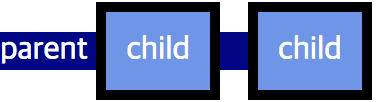

# 레이아웃

- display

    모든 요소는 기본적으로 가지고 있는 display 값이 있습니다.
    그리고 그 값에 따라 블록 레벨, 인라인 레벨 등 렌더링 박스의 유형이 결정됩니다.
    display 속성을 통해 해당 요소의 렌더링 박스의 유형을 변경할 수 있으며, 심지어 렌더링 여부도 결정할 수 있습니다.

    ### display 속성 (default=? [요소마다 다름])

    요소의 렌더링 박스 유형을 결정하는 속성입니다.

    ```css
    display: value;
    ```

    - none : 요소가 렌더링 되지 않음
    - block : 블록 레벨 요소처럼 렌더링
    - inline : 인라인 레벨 요소처럼 렌더링
    - inline-block : 인라인 요소처럼 렌더링(배치) 되지만 블록 레벨의 성질을 가짐
    * height나 width 등과 같은 박스 모델 속성을 적용할 수 있음

    이외에도 list-item, flex, inline-flext, table, table-cell 등 다양한 속성값 존재

    ```html
    <!DOCTYPE html>
    <html lang="ko">
    	<head>
    		<meta charset="UTF-8">
    		<title>display</title>
    	</head>
    	<body>
    		<div>
    			<div style="display: none;">box1</div>
    		</div>
    		<div>
    			<div style="display: inline;">box2</div>
    		</div>
    		<div>
    			<div style="display: block;">box3</div>
    		</div>
    		<div>
    			<div style="display: inline-block;">box4</div>
    		</div>
    	</body>
    </html>
    ```

    ### inline과 inline-block의 차이

    inline-block의 경우 inline처럼 자기 콘텐츠 크기만큼 영역을 차지합니다.
    inline-block은 inline 레벨 요소처럼 화면에 나타나지만 block의 성질을 갖고있다고 이해하면 됩니다.

    ```html
    <div>
    	<div style="display: inline;">box</div>
    </div>

    <div>
    	<div style="display: inline-block;">box</div>
    </div>
    ```

    display: inline;과 display: inline-block;의 box model을 비교했을때 inline의 경우에는 auto, auto로 되어있고 inline-block의 경우에는 해당 내용의 width height 값이 선언되어 있습니다.

    이는 block처럼 rendering 값을 갖는다는 뜻입니다.
    display가 어떤 값을 갖는지에 따라서 box model의 속성들을 적용할 수 있는지 없는지의 유무가 정해집니다.

    ### inline 레벨 요소 사이의 공백과 개행

    ```html
    .inline {
    	font-size: 30px;
    	background: pink;
    }

    .inlineblock {
    	font-size: 30px;
    	background: skyblue;
    }

    ...
    <div>
    	<div style="display: inline;" class="inline">box</div>
    	<div style="display: inline;" class="inline">box</div>
    	<div style="display: inline;" class="inline">box</div>
    </div>

    <div>
    	<div style="display: inline;" class="inline">box</div><div style="display: inline;" class="inline">box</div>
    	<div style="display: inline;" class="inline">box</div>
    </div>

    <div>
    	<div style="display: inline;" class="inline">box</div> <div style="display: inline;" class="inline">box</div> <div style="display: inline;" class="inline">box</div>
    </div>

    <div>
    	<div style="display: inline-block;" class="inlineblock">box</div>
    	<div style="display: inline-block;" class="inlineblock">box</div>
    	<div style="display: inline-block;" class="inlineblock">box</div>
    </div>

    <div>
    	<div style="display: inline-block;" class="inlineblock">box</div><div style="display: inline-block;" class="inlineblock">box</div>
    	<div style="display: inline-block;" class="inlineblock">box</div>
    </div>

    <div>
    	<div style="display: inline-block;" class="inlineblock">box</div> <div style="display: inline-block;" class="inlineblock">box</div> <div style="display: inline-block;" class="inlineblock">box</div>
    </div>
    ```

    inline 요소의 경우 공백과 개행에 대해서 하나의 여백으로 받아들입니다.
    공백도 하나의 inline box를 갖습니다.
    따라서 inline과 inline-block의 경우 태그 사이의 공백이나 개행이 있을 경우 약 4px의 여백을 가집니다.

    ### display와 box model의 관계

    display 속성의 값에 따라 box model의 속성들의 적용 유무를 확인할 수 있습니다.

    ```css
    display       width  height  margin  padding  border
    block           O      O       O        O       O
    inline          X      X      좌/우    좌/우(*)  좌/우(*)
    inline-block    O      O       O        O       O
    ```

    **inline 요소의 padding/border 속성이 좌/우(*)만 적용이 되는 이유**

    실제로 inline 요소의 padding/border는 좌/우 뿐만아니라 상/하에도 적용이 됩니다.

    **parent는 `<div>`, child는 `<span>`**

    
    하지만 상/하 padding/border는 line-box에는 영향을 주지 못하기 때문에 위와 같이 부모 요소의 박스에 반영되지 않습니다.

    **parent는 `<div>`, child는 `<span>`**

    
    또한 인접한 다른 line-box에도 반영되지 않습니다.
    즉, 콘텐츠가 겹칠수 있기 때문에 실무에서는 잘 사용하지 않습니다.

    ---

    ### 실습 코드

    ```html
    <!DOCTYPE html>
    <html lang="ko">
    	<head>
    		<meta charset="UTF-8">
    		<title>display</title>
    		<style>
    			.inline {
    				width: 100px; /* box model의 값 변화없이 auto auto */
    				height: 100px; /* box model의 값 변화없이 auto auto */
    				margin: 10px; /* 화면에서 좌, 우만 margin 영역이 확인되나 box model에는 상하좌우 다 선언된 것처럼 보임 */
    				padding: 10px; /* 배경 영역이 커진 것을 확인 가능하고 box model에 상하좌우 다 선언된 것처럼 보임 */
    				border: 10px solid red; /* box model에 상하좌우 다 선언된 것처럼 보임 */
    				background: pink;
    			}

    			.block {
    				width: 100px;
    				height: 100px;
    				margin: 10px;
    				padding: 10px;
    				border: 10px solid blue;
    				background: skyblue;
    			}

    			.inlineblock {
    				width: 100px;
    				height: 100px;
    				margin: 10px;
    				padding: 10px;
    				border: 10px solid green;
    				background: mediumspringgreen;
    			}
    		</style>
    	</head>
    	<body>
    		<div>
    			<div style="display: none;">box</div>
    		</div>
    		<div>
    			<div style="display: inline;" class="inline">box</div>
    		</div>
    		<div>
    			<div style="display: block;" class="block">box</div>
    		</div>
    		<div>
    			<div style="display: inline-block;" class="inlineblock">box</div>
    		</div>
    	</body>
    </html>
    ```

    ```html
    <!DOCTYPE html>
    <html lang="ko">
    	<head>
    		<meta charset="UTF-8">
    		<title>display</title>
    		<style>
    			body > div {
    				padding: 5px;
    				border: 1px dashed #aaa;
    			}

    			.box {
    				padding: 15px;
    				border: 1px solid #aaa;
    				background-color: #eee;
    			}

    			.none .box {
    				display: none;
    			}

    			.inline .box {
    				display: inline;
    			}

    			.block .box {
    				display: block;
    			}

    			.inline-block .box {
    				display: inline-block;
    			}

    			.list-item .box {
    				display: list-item;
    			}
    		</style>
    	</head>
    	<body>
    		<h1>display</h1>
    		<h2>none</h2>
    		<div class="none">
    			<div class="box">box1</div>
    			<div class="box">box2</div>
    			<div class="box">box3</div>
    		</div>
    		<h2>inline</h2>
    		<div class="inline">
    			<div class="box">box1</div>
    			<div class="box">box2</div>
    			<div class="box">box3</div>
    			<div class="box">box4</div>
    			<div class="box">box5</div>
    			<div class="box">box6</div>
    			<div class="box">box7</div>
    			<div class="box">box8</div>
    			<div class="box">box9</div>
    			<div class="box">box10</div>
    		</div>
    		<h2>block</h2>
    		<div class="block">
    			<div class="box">box1</div>
    			<div class="box">box2</div>
    			<div class="box">box3</div>
    		</div>
    		<h2>inline-block</h2>
    		<div class="inline-block">
    			<div class="box">box1</div>
    			<div class="box">box2</div>
    			<div class="box">box3</div>
    		</div>
    		<h2>list-item</h2>
    		<div class="list-item">
    			<div class="box">box1</div>
    			<div class="box">box2</div>
    			<div class="box">box3</div>
    		</div>
    	</body>
    </html>
    ```

    ---

    ### 참고자료

    [display](https://developer.mozilla.org/en-US/docs/Web/CSS/display)

    [CSS display property](https://www.w3schools.com/cssref/pr_class_display.asp)

    [CSS Layout - The display Property](https://www.w3schools.com/css/css_display_visibility.asp)

- visibility

    CSS에서 요소를 숨기는 방법에는 몇 가지가 있습니다.
    display 속성에서 배웠듯이 아예 렌더링 되지 않게끔 할 수도 있고, 
    다른 위치 관련 속성들을 이용해서 안보이게 숨기는 방법도 있습니다.
    하지만 요소를 숨긴다는 의미로만 해석하면 가장 명시적인 방법은 visibility 속성을 이용하는 것입니다.

    ### visibility 속성 (default=visible)

    요소의 화면 표시 여부를 지정하는 속성입니다.

    ```css
    visibility: visible|hidden|collapse|initial|inherit;
    ```

    - visible : 화면에 표시 (기본값)
    - hidden : 화면에 표시되지 않음 (요소가 갖고 있는 영역은 존재함)
    - collapse : 셀 간의 경계를 무시하고 숨김 (테이블 관련 요소에만 적용 가능)

    ```css
    visibility: visible; /* 보임 (기본값) */
    visibility: hidden; /* 숨김 (자신의 박스 영역은 유지. margin까지 모두 포함 */
    visibility: collapse; /* 셀 간의 경계를 무시하고 숨김 (박스 영역 없음. 테이블의 행과 열 요소에만 지정 가능하고 그 외 요소 지정은 hidden과 동일 */
    ```

    ### display: none과의 차이점

    - display: none → 요소가 렌더링 되지 않음 (DOM에 존재하지 않음)
    - visibility: hidden → 요소가 보이지는 않지만 렌더링 되며 화면에 공간을 가짐 (DOM에 존재함)

    ---

    ### 참고자료

    [visibility](https://developer.mozilla.org/en-US/docs/Web/CSS/visibility)

    [CSS visibility property](https://www.w3schools.com/cssref/pr_class_visibility.asp)

- float

    모든 요소는 기본적으로 보통의 흐름에 따라 위에서 아래로, 그리고 좌측에서 우측으로 배치됩니다.
    요소 박스의 경계대로 차례대로 배치되며, float 속성은 요소를 보통의 흐름에서 벗어나 독자적인 공간 위에 배치되게 됩니다.
    float 속성을 이용하면 주변 요소들과 더욱 자연스럽게 배치될 수 있지만, floating 되지 않은 주변 요소들에도 영향을 주기 때문에 잘 이해하고 사용해야 합니다.

    ### float 속성 (default=none)

    ```css
    float: none|left|right|initial|inherit;
    ```

    - none : float 시키지 않음 (기본값)
    - left : 좌측으로 float 시킴
    - right : 우측으로 float 시킴

    float 속성은 대표적으로 세 가지 특징을 갖습니다.

    - 요소를 보통의 흐름에서 벗어나 띄워지게 함
    - 주변 텍스트나 인라인 요소가 주위를 감싸는 특징
    - 대부분 요소의 display 값을 block으로 변경함
    예외적으로 inline-table, flext 등은 display 값이 block으로 변경되지 않고,
    기존의 display 값을 유지

    ### 요소를 보통의 흐름에서 벗어나 띄워지게 함

    ```html
    <!DOCTYPE html>
    <html lang="ko">
    	<head>
    		<meta charset="UTF-8">
    		<title>float</title>
    		<style>
    			.container {
    				width: 400px;
    				padding: 15px;
    				border: 1px dashed #aaa;
    			}

    			.container div {
    				width: 100px;
    				height: 100px;
    			}

    			.container div:nth-child(1) {
    				background-color: steelblue;
    			}

    			.container div:nth-child(2) {
    				background-color: lightseagreen;
    			}
    		</style>
    	</head>
    	<body>
    		<h2>요소를 보통의 흐름에서 벗어나 띄워지게 함</h2>
    		<h3>box1, box2 float:none</h3>
    		<div class="container">
    			<div style="">Box1</div>
    			<div style="">Box2</div>
    		</div>

    		<h3>box1만 float:left 속성 적용</h3>
    		<div class="container">
    			<div style="float: left;">Box1</div>
    			<div style="">Box2</div>
    		</div>

    		<h3>box1, box2 모두 float:left 속성 적용</h3>
    		<div class="container">
    			<div style="float: left;">Box1</div>
    			<div style="float: left;">Box2</div>

    			<!-- 모든 요소마다 이런식으로 float이 들어갈 수 있는데 
    			앞에 어떤 내용의 float이 올지 모르는 상황에서 
    			모든 요소에 다 clear 속성을 선언하게 되면 
    			불필요한 속성을 너무 많이 선언하게 되기 때문에 
    			일반적으로 해당 자식 요소들이 float을 갖고 있을 수 있으므로 
    			부모 요소에서 이 안의 내용들이 모두 clear 될 수 있도록 작업합니다. -->
    			<!-- span의 display를 block으로 꼭 변경해 주어야 한다. -->
    			<span style="display: block; clear: both"></span>
    		</div>

    		<h3 style="clear: both;">box2 영역을 확인하기 위해 border 속성 적용, box1 float:left</h3>
    		<div class="container">
    			<div style="float: left;">Box1</div>
    			<div style="border: 2px solid red;">Box2</div>
    		</div>

    		<h3>box2 height 크기 조정, box1 float:left</h3>
    		<div class="container">
    			<div style="float: left;">Box1</div>
    			<div style="height: 150px; border: 2px solid red;">Box2</div>
    		</div>

    		<h3>box2 height, width 크기 조정, box1 float:left</h3>
    		<div class="container">
    			<div style="float: left;">Box1</div>
    			<div style="height: 150px; width: 150px; border: 2px solid red;">Box2</div>
    		</div>

    		<h3>box2 height, width auto, box1 float:left</h3>
    		<div class="container">
    			<div style="float: left;">Box1</div>
    			<div style="height: auto; width: auto; border: 2px solid red;">Box2</div>
    		</div>
    	</body>
    </html>
    ```

    ### 주변 텍스트나 인라인 요소가 주위를 감싸는 특징

    ```html
    <!DOCTYPE html>
    <html lang="ko">
    	<head>
    		<meta charset="UTF-8">
    		<title>float</title>
    		<style>
    			.container {
    				width: 400px;
    				padding: 15px;
    				border: 1px dashed #aaa;
    			}

    			.container div {
    				width: 100px;
    				height: 100px;
    			}

    			.container div:nth-child(1) {
    				background-color: steelblue;
    			}

    			.container div:nth-child(2) {
    				background-color: lightseagreen;
    			}
    		</style>
    	</head>
    	<body>
    		<h2>주변 텍스트나 인라인 요소가 주위를 감싸는 특징</h2>
    		<h3>box1, box2 opacity:0.5, box1 float:left, box2 float:right, p border background</h3>
    		<div class="container">
    			<div style="float: left; opacity: 0.5;">Box1</div>
    			<div style="float: right; opacity: 0.5;">Box2</div>
    			<p style="border: 2px solid red; background: pink;">
    				Lorem ipsum dolor sit amet consectetur adipisicing elit.
    				Ipsam aspernatur vitae sapiente laudantium velit quo unde cupiditate autem, 
    				harum eaque natus perferendis ducimus saepe libero, voluptatibus voluptates possimus.
    				Adipisci, delectus.
    			</p>
    		</div>
    	</body>
    </html>
    ```

    ### 대부분 요소의 display값을 block으로 변경

    ```html
    <!DOCTYPE html>
    <html lang="ko">
    	<head>
    		<meta charset="UTF-8">
    		<title>float</title>
    		<style>
    			.container {
    				width: 400px;
    				padding: 15px;
    				border: 1px dashed #aaa;
    			}

    			.container div {
    				width: 100px;
    				height: 100px;
    			}

    			.container .box {
    				width: 100px;
    				height: 100px;
    			}

    			.container div:nth-child(1) {
    				background-color: steelblue;
    			}

    			.container div:nth-child(2) {
    				background-color: lightseagreen;
    			}
    		</style>
    	</head>
    	<body>
    		<h2>대부분 요소의 display값을 block으로 변경</h2>
    		<h3>span의 width, height속성이 지정되어도 display가 inline이기 때문에 auto x auto 크기를 가짐</h3>
    		<div class="container">
    			<div style="" class="box">div Box1</div>
    			<span style="background: skyblue;" class="box">span Box2</span>
    		</div>

    		<h3>span의 float 속성을 선언하면 display가 block으로 변경</h3>
    		<div class="container">
    			<div style="" class="box">div Box1</div>
    			<span style="float: left; background: skyblue;" class="box">span Box2</span>
    		</div>
    	</body>
    </html>
    ```

    ---

    ### 참고자료

    [float](https://developer.mozilla.org/en-US/docs/Web/CSS/float)

    [CSS float property](https://www.w3schools.com/cssref/pr_class_float.asp)

    [CSS Layout - float and clear](https://www.w3schools.com/css/css_float.asp)

    [CSS Layout - Float Examples](https://www.w3schools.com/css/css_float_examples.asp)

- clear

    float 속성에서 배웠듯이 floating 요소는 주변 요소들의 배치에도 영향을 줍니다.
    그러므로 가끔 주변 요소들이 의도하지 않은대로 나타날 수 있는데, clear 속성을 사용하여 이 문제를 해결할 수 있습니다.
    의도한게 아니라면 대부분 floating 요소 다음 요소에 바로 clear를 해주는게 좋습니다.
    clear 속성은 float 속성과 항상 따라다니는 속성이므로 잘 알아두어야 합니다.

    ### clear 속성 (default=none)

    요소를 floating 된 요소의 영향에서 벗어나게 하는 속성입니다.

    ```css
    clear: none|left|right|both|initial|inherit;
    ```

    - none : 양쪽으로 floating 된 요소를 허용 (기본값)
    - left : 왼쪽으로 floating 된 요소를 허용하지 않음
    - right : 오른쪽으로 floating 된 요소를 허용하지 않음
    - both : 양쪽으로 floating 된 요소를 허용하지 않음

    **clear 속성은 block level 요소만 적용 가능**

    ```css
    clear: none; /* 기본값 */
    clear: left; /* 왼쪽 요소 float의 영향에서 벗어남 */
    clear: right; /* 오른쪽 요소 float의 영향에서 벗어남 */
    clear: both; /* 양쪽 모두 벗어남 */
    ```

    ---

    ### 실습 코드

    ```html
    <!DOCTYPE html>
    <html lang="ko">
    	<head>
    		<meta charset="UTF-8">
    		<title>clear</title>
    		<style>
    			.container {
    				border: 1px dashed #aaa;
    			}

    			div, span {
    				border: 1px solid red;
    				padding: 20px;
    			}
    		</style>
    	</head>
    	<body>
    		<h1>float: left</h1>
    		<h2>clear: none</h2>
    		<div class="container">
    			<div style="float: left;">float: left;</div>
    			<span style="display: block; clear: none;">
    				Lorem ipsum dolor sit amet consectetur adipisicing elit.
    				Ipsam aspernatur vitae sapiente laudantium velit quo unde cupiditate autem, 
    			</span>
    		</div>

    		<h2>clear: left</h2>
    		<div class="container">
    			<div style="float: left;">float: left;</div>
    			<span style="display: block; clear: left;">
    				Lorem ipsum dolor sit amet consectetur adipisicing elit.
    				Ipsam aspernatur vitae sapiente laudantium velit quo unde cupiditate autem, 
    			</span>
    		</div>

    		<h2>clear: right</h2>
    		<div class="container">
    			<div style="float: left;">float: left;</div>
    			<span style="display: block; clear: right;">
    				Lorem ipsum dolor sit amet consectetur adipisicing elit.
    				Ipsam aspernatur vitae sapiente laudantium velit quo unde cupiditate autem, 
    			</span>
    		</div>

    		<h1>float: right</h1>
    		<h2>clear: left</h2>
    		<div class="container">
    			<div style="float: right;">float: right;</div>
    			<span style="display: block; clear: left;">
    				Lorem ipsum dolor sit amet consectetur adipisicing elit.
    				Ipsam aspernatur vitae sapiente laudantium velit quo unde cupiditate autem, 
    			</span>
    		</div>

    		<h2>clear: right</h2>
    		<div class="container">
    			<div style="float: right;">float: right;</div>
    			<span style="display: block; clear: right;">
    				Lorem ipsum dolor sit amet consectetur adipisicing elit.
    				Ipsam aspernatur vitae sapiente laudantium velit quo unde cupiditate autem, 
    			</span>
    		</div>

    		<h2>inline-block, clear: right</h2>
    		<div class="container">
    			<div style="float: right;">float: right;</div>
    			<span style="display: inline-block; clear: right;">
    				Lorem ipsum dolor sit amet consectetur adipisicing elit.
    				Ipsam aspernatur vitae sapiente laudantium velit quo unde cupiditate autem, 
    			</span>
    		</div>

    		<h1>float: left, right</h1>
    		<h2>clear: both</h2>
    		<div class="container">
    			<div style="float: left;">float: left;</div>
    			<div style="float: right;">float: right;</div>
    			<span style="display: block; clear: both;">
    				Lorem ipsum dolor sit amet consectetur adipisicing elit.
    				Ipsam aspernatur vitae sapiente laudantium velit quo unde cupiditate autem, 
    			</span>
    		</div>
    	</body>
    </html>
    ```

    ---

    ### 참고자료

    [clear](https://developer.mozilla.org/en-US/docs/Web/CSS/clear)

    [CSS clear property](https://www.w3schools.com/cssref/pr_class_clear.asp)

    [CSS Layout - clear and clearfix](https://www.w3schools.com/css/css_float_clear.asp)

- position

    요소의 레이아웃을 설정하는 대표적인 속성은 position 속성입니다.
    position 속성은 요소의 위치를 원하는 곳으로 이동할 수 있게 합니다.
    position 속성을 사용하기 위해서는 요소를 이동시키기 위한 좌표 속성인 offset에 대해서도 알아야 합니다.
    position과 offset 속성을 잘 활용하면 더 다양하고 화려한 레이아웃을 구현할 수 있습니다.

    ### position 속성 (default=static)

    요소의 위치를 원하는 곳으로 이동 시킬때 사용하는 속성

    ```css
    position: static|relative|absolute|fixed|sticky|initial|inherit;
    ```

    - static : Normal-flow에 따라 배치되며 offset 값이 적용되지 않음 (기본값)
    - relative : Normal-flow의 흐름을 따름
                    자신이 원래 있어야 할 위치를 기준으로 offset에 따라 배치
                    부모의 position 속성에 영향을 받지 않음
                    주변 요소에 영향을 주지 않으면서 offset 값으로 이동
                    *** 자기 자신의 요소 왼쪽 상단을 기준점으로 함**
    - absolute : Normal-flow의 흐름에서 벗어남
                      부모 요소의 위치를 기준으로 offset에 따라 배치
                      부모가 position 값(static 제외)을 가지면 offset 값의 시작점이 됨
                      *** 부모의 position 값이 static인 경우 조상의 position 값이 static
                          이 아닐때까지 거슬러 올라가 기준으로 잡음 (없을 경우 body 기준)**
                      *** 부모의 padding영역을 포함 containing block을 기준점으로 함**
    - fixed : view-port(브라우저의 창)를 기준으로 offset에 따라 배치
                즉, 화면 스크롤에 관계없이 항상 화면의 정해진 위치에 정보가 나타남
                부모의 위치에 영향을 받지 않음

    **Normal-flow란?**
    일반적인 상황에서 각각의 요소들의 성질에 따라 배치되는 순서(흐름)을 뜻합니다.
    예를 들면, block 레벨 요소들은 상하로 배치되고, inline 레벨 요소들은 좌우로 배치되는것을 말합니다.

    absolute와 fixed의 경우 inline 요소에 선언하게 되는 경우 display 값을 block으로 변경하므로 box model 관련 속성들을 모두 선언할 수 있음

    ```css
    position: static; /* 기본값, 정적인 위치, 정상흐름 대로 배열, offset 좌표설정 적용안됨 */
    position: relative; /* 상대적인 위치, 정상흐름 대로 배열, 주변요소들에 영향을 주지않으면서 offset 이동 */
    position: absolute; /* 절대적인 위치, 정상흐름에서 벗어나 offset으로 이동, 부모를 기준으로 부모가 상대/절대위치를 가지면 offset 값의 기준점이 됨 */
    position: fixed; /* 고정적인 위치, 뷰포트상에서 offset으로 이동, 부모위치에 영향을 받지않음 */
    ```

    ### offset 속성 (top/bottom/left/right)

    ```css
    top|bottom|left|right: auto|lenght|initial|inherit;
    ```

    ```css
    top: 10%;
    bottom: 20px;
    left: -30px;
    right: auto;
    ```

    offset의 % 단위 사용 이전에 padding과 margin에서 % 값을 적용할때, 상하좌우 방향에 관계없이 가로 사이즈를 기준으로 % 값이 계산된다고 배웠습니다.
    그러나, offset은 top, bottom(상하)는 기준이 되는 요소의 height 값, left, right(좌우)는 width 값에 대하여 계산되어 집니다.

    ---

    ### 실습 코드

    **offset 미지정**

    ```html
    <!DOCTYPE html>
    <html lang="ko">
    	<head>
    		<meta charset="UTF-8">
    		<title>position</title>
    		<style>
    			.parent {
    				border: 1px dashed #aaa;
    				padding: 10px;
    			}

    			.sibling {
    				padding: 5px;
    				background-color: #eee;
    				text-align: center;
    			}

    			.child, .child_offset {
    				width: 60px;
    				height: 60px;
    				border: 1px solid #333;
    				padding: 20px;
    				background-color: #dc3636;
    				text-align: center;
    				color: #fff;
    				font-weight: bold;
    			}

    			.child_offset {
    				background-color: #3677dc;
    			}

    			.static {
    				position: static;
    			}

    			.relative {
    				position: relative;
    			}

    			.absolute {
    				position: absolute;
    			}

    			.fixed {
    				position: fixed;
    			}
    		</style>
    	</head>
    	<body>
    		<div>
    			<h1>position offset 미지정</h1>
    			<h2>position: static;</h2>
    			<div class="parent">
    				<div class="sibling">Sibling 1</div>
    				<div class="child static">static</div>
    				<div class="sibling">Sibling 2</div>
    			</div>

    			<h2>position: relative;</h2>
    			<div class="parent">
    				<div class="sibling">Sibling 1</div>
    				<!-- 현재는 offset 값을 선언하지 않았기 때문에 static과 relative는 차이가 없음 -->
    				<div class="child relative">relative</div>
    				<div class="sibling">Sibling 2</div>
    			</div>

    			<h2>position: absolute;</h2>
    			<div class="parent">
    				<div class="sibling">Sibling 1</div>
    				<!-- absolute, fixed는 inline 요소일때 display: block; 으로 변경시키고 inline-block 값을 임의 지정했을 때는 그 값을 유지함 -->
    				<span class="child absolute">absolute</span>
    				<div class="sibling">Sibling 2</div>
    			</div>

    			<h2>position: fixed;</h2>
    			<div class="parent">
    				<div class="sibling">Sibling 1</div>
    				<!-- 현재 fixed는 offset 값이 없어 뷰포트 밖으로 밀려나오면서 화면 아래로 사라짐 -->
    				<div class="child fixed">fixed</div>
    				<div class="sibling">Sibling 2</div>
    			</div>
    		</div>
    	</body>
    </html>
    ```

    **offset 지정**

    ```html
    <!DOCTYPE html>
    <html lang="ko">
    	<head>
    		<meta charset="UTF-8">
    		<title>position & offset</title>
    		<style>
    			.parent {
    				border: 1px dashed #aaa;
    				padding: 10px;
    			}

    			.sibling {
    				padding: 5px;
    				background-color: #eee;
    				text-align: center;
    			}

    			.child, .child_offset {
    				width: 60px;
    				height: 60px;
    				border: 1px solid #333;
    				padding: 20px;
    				background-color: #dc3636;
    				text-align: center;
    				color: #fff;
    				font-weight: bold;
    			}

    			.child_offset {
    				background-color: #3677dc;
    			}

    			.static {
    				position: static;
    			}

    			.relative {
    				position: relative;
    			}

    			.absolute {
    				position: absolute;
    			}

    			.fixed {
    				position: fixed;
    			}
    		</style>
    	</head>
    	<body>
    		<div>
    			<h1>position offset 지정</h1>
    			<h2>position: static;</h2>
    			<div class="parent">
    				<div class="sibling">Sibling 1</div>
    				<!-- static의 경우 offset 값이 적용되지 않음 -->
    				<!-- 개발자 도구에서도 속성으로 주어진 top, left 값이 그대로 적용되어 있고 속성에 느낌표라던지 취소선같은 표시도 없음 -->
    				<!-- 개발자가 알고 있어야 하는 스펙으로 브라우저에서 속성값의 조합을 고려하면서까지 오류를 알려주지 않음 -->
    				<!-- 때문에 offset 값이 적용되지 않는 position: static;이나 position의 default 값(static)인지 확인하여야 함 -->
    				<div class="child_offset static" style="top: 40px; left: 40px;">static <br>top: 40, left: 40</div>
    				<div class="sibling">Sibling 2</div>
    			</div>

    			<h2>position: relative;</h2>
    			<div class="parent">
    				<div class="sibling">Sibling 1</div>
    				<!-- offset 값이 있는 경우 자기 자신의 위치를 기준으로 삼아서 offset 값만큼 위치 변경 -->
    				<!-- 자기 자신의 요소 왼쪽 상단을 영점으로해서 기준 -->
    				<div class="child_offset relative" style="top: 40px; left: 40px;">relative <br>top: 40, left: 40</div>
    				<div class="sibling">Sibling 2</div>
    			</div>

    			<h2>position: absolute;</h2>
    			<!-- 부모 요소의 위치를 기준으로 offset에 따라 배치됨 -->
    			<!-- 부모 요소의 position 값이 default(static)인 경우 조상의 position 값이 static이 아닐때까지 거슬러 올라감 -->
    			<!-- 조상의 position 값이 모두 static인 경우 body를 기준으로 offset에 따라 배치됨 -->
    			<div class="parent">
    				<div class="sibling">Sibling 1</div>
    				<span class="child_offset absolute" style="top: 40px; left: 80px;">absolute <br>top: 40, left: 80</span>
    				<div class="sibling">Sibling 2</div>
    			</div>

    			<h2>position: absolute; parent: realtive</h2>
    			<div class="parent relative">
    			<!-- 이곳의 parent는 position 값을 relative로 가지므로 child의 기준이 됨 -->
    				<div class="sibling">Sibling 1</div>
    				<span class="child_offset absolute" style="top: 40px; left: 80px;">parent relative <br>absolute <br>top: 40, left: 80</span>
    				<div class="sibling">Sibling 2</div>
    			</div>

    			<h2>position: absolute; parent: realtive</h2>
    			<!-- 그렇다면 parent가 갖는 기준점은 어디부터인가? -->
    			<!-- margin, border 영역을 제외하고 padding 영역부터 기준으로 삼는다 -->
    			<!-- padding 영역까지 포함한 영역을 containing block 이라고 함 -->
    			<div class="parent relative" style="margin: 50px; border: 10px dashed #aaa;">
    				<div class="sibling">Sibling 1</div>
    				<span class="child_offset absolute">parent relative <br>absolute</span>
    				<div class="sibling">Sibling 2</div>
    			</div>

    			<h2>position: fixed;</h2>
    			<!-- 부모의 위치와 상관없이 별개로 브라우저의 좌표값을 기준으로 위치함 -->
    			<div class="parent">
    				<div class="sibling">Sibling 1</div>
    				<!-- inline 요소인 span의 경우에도 position: fixed;를 하게되면 display: block;으로 변경 -->
    				<span class="child_offset fixed" style="top: 100px; left: 80%;">fixed <br>top: 100, left: 80%</span>
    				<div class="sibling">Sibling 2</div>
    			</div>
    		</div>
    	</body>
    </html>
    ```

    ---

    ### 참고자료

    [position](https://developer.mozilla.org/en-US/docs/Web/CSS/position)

    [CSS Layout - The position Property](https://www.w3schools.com/css/css_positioning.asp)

    [CSS position property](https://www.w3schools.com/cssref/pr_class_position.asp)

- z-index

    요소의 위치를 지정하다 보면 부득이하게 두 요소가 겹쳐지게 되는 경우가 있습니다.
    결국 둘 중 하나는 다른 요소로 인해 덮어쓰게 됩니다.
    이때 어느 요소가 더 위로 올라와야 하는지는 요소들의 쌓임 순서의 규칙에 따라 위치하게 되는데, 이것을 정하는 것이 바로 z-index의 역할입니다.
    쌓임 순서는 z-index 속성을 이용하여 바꿀수 있습니다.

    ### z-index 속성 (default=auto)

    요소가 겹치는 순서(쌓임 순서 또는 stack order)를 지정하는 속성입니다.

    ```css
    z-index: auto|number|initial|inherit;
    ```

    - auto : 쌓임 순서를 부모와 동일하게 설정 (기본값)
    - number : 해당 수치로 쌓임 순서를 설정 (음수 가능)

    ```css
    z-index: 1;
    ```

    - position 값이 static이 아닌 경우 지정 가능
    - 순서 값이 없을 경우 생성 순서(코드상 순서)에 따라 쌓임
    - 부모가 z-index 값이 있을 경우 부모 안에서만 의미 있음
    - 큰 값이 가장 위쪽 (음수 사용 가능)

    ```html
    <!DOCTYPE html>
    <html lang="ko">
    	<head>
    		<meta charset="UTF-8">
    		<title>z-index</title>
    		<style>
    			.z_area:nth-child(2) {
    				position: absolute;
    				top: 300px;
    			}

    			.z_area #myBox {
    				position: absolute;
    				width: 100px;
    				height: 100px;
    				border: 1px solid black;
    				background-color: red;
    			}

    			.box {
    				position: absolute;
    				width: 100px;
    				height: 100px;
    				border: 1px solid black;
    				background-color: yellow;
    				opacity: 0.6;
    			}
    		</style>
    	</head>
    	<body>
    		<div class="z_area">
    			<div id="myBox" style="position: absolute; background-color: red;">myBox</div>
    			<div class="box" style="position: absolute; top: 20px; left: 20px;">z-index auto</div>
    			<div class="box" style="position: absolute; top: 40px; left: 40px;">z-index auto</div>
    			<div class="box" style="position: absolute; top: 60px; left: 60px;">z-index auto</div>
    			<div class="box" style="position: absolute; top: 80px; left: 80px;">z-index auto</div>
    		</div>

    		<div class="z_area">
    			<div id="myBox" style="position: absolute; background-color: red; z-index: 4;">myBox</div>
    			<div class="box" style="position: absolute; top: 20px; left: 20px; z-index: 0;">z-index 0</div>
    			<div class="box" style="position: absolute; top: 40px; left: 40px; z-index: 1;">z-index 1</div>
    			<div class="box" style="position: absolute; top: 60px; left: 60px; z-index: 2;">z-index 2</div>
    			<div class="box" style="position: absolute; top: 80px; left: 80px; z-index: 3;">z-index 3</div>
    		</div>
    	</body>
    </html>
    ```

    ### 부모가 z-index 값이 있을 경우 부모 안에서만 의미 있음

    ```html
    <!DOCTYPE html>
    <html lang="ko">
    	<head>
    		<meta charset="UTF-8">
    		<title>parent z-index value</title>
    		<style>
    			.parent {
    				z-index: 10;
    				position: relative;
    				width: 300px;
    				height: 50px;
    				border: 2px solid black;
    				background-color: gray;
    			}

    			.child {
    				z-index: 10;
    				position: absolute;
    				top: 10px;
    				right: 20px;
    				width: 100px;
    				height: 100px;
    				border: 2px solid red;
    				background-color: pink;
    			}
    		</style>
    	</head>
    	<body>
    		<div class="z_area">
    			<!-- <div class="parent" style="position: relative;">position: relative; -->
    			<div class="parent" style="position: relative; z-index: 11;">position: relative;
    				<!-- <div class="child" style="right: 20px; z-index: 10;">position: absolute;</div> -->
    				<div class="child" style="right: 20px; z-index: 1000;">position: absolute;</div>
    			</div>

    			<div class="parent" style="position: relative;">position: relative;
    				<!-- <div class="child" style="right: 10px; z-index: 10;">position: absolute;</div> -->
    				<div class="child" style="right: 10px;">position: absolute;</div>
    			</div>
    		</div>
    	</body>
    </html>
    ```

    ---

    ### 실습 코드

    ```html
    <!DOCTYPE html>
    <html lang="ko">
    	<head>
    		<meta charset="UTF-8">
    		<title>z-index Stacking Context</title>
    		<style>
    			div {
    				width: 500px;
    				border: 1px dashed #696;
    				padding: 10px;
    				margin: 10px;
    				background-color: #5ae05a;
    				opacity: 0.7;
    			}

    			div > div {
    				width: 90%;
    			}

    			#div1 {
    				margin-bottom: 190px;
    			}

    			#div3 {
    				top: 80px;
    				left: 180px;
    				width: 400px;
    				padding-top: 50px;
    				background-color: yellow;
    				opacity: 1;
    			}

    			#div4, #div5 {
    				background-color: #ff8f00;
    			}

    			#div6 {
    				top: 20px;
    				left: 180px;
    				width: 150px;
    				height: 125px;
    				padding-top: 110px;
    				background-color: #e600ff;
    			}
    		</style>
    	</head>
    	<body>
    		<h1>z-index (Stacking Context)</h1>
    		<div id="div1" style="position: relative; z-index: 5;">
    			<strong>#1</strong><br>
    			<code>position: relative;<br/>z-index: 5;</code>
    		</div>
    		<div id="div2" style="position: relative; z-index: 2;">
    			<strong>#2</strong><br>
    			<code>position: relative;<br/>z-index: 2;</code>
    		</div>
    		<div id="div3" style="position: absolute; z-index: 4;">
    			<div id="div4" style="position: relative; z-index: 6;">
    				<strong>#4</strong><br>
    				<code>position: relative;<br/>z-index: 6;</code>
    			</div>
    			<strong>#3</strong><br>
    			<code>position: absolute;<br/>z-index: 4;</code>
    			<div id="div5" style="position: relative; z-index: 1;">
    				<strong>#5</strong><br>
    				<code>position: relative;<br/>z-index: 1;</code>
    			</div>
    			<div id="div6" style="position: absolute; z-index: 3;">
    				<strong>#6</strong><br>
    				<code>position: absolute;<br/>z-index: 3;</code>
    			</div>
    		</div>

    		<h2>설명:</h2>
    		<ul>
    			<li>#4는 #1보다 z-index 값이 더 크지만 #1보다 아래에 렌더링 됨</li>
    			<li>#1의 z-index: 5;는 뿌리 엘리먼트의 쌓임 맥락 안에서 유효하나 #4의 z-index: 6;은 #3의 쌓임 맥락 안에서만 유효하기 때문</li>
    			<li>#4는 자신이 속하는 #3의 z-index: 3;이므로 #1 아래에 쌓임, 같은 이유로 #2는 #5 아래에 렌더링 됨</li>
    			<li>#5는 #2보다 z-index 값이 작지만, #5가 속한 #3의 z-index 값이 #2의 z-index 값보다 더 크기 때문</li>
    			<li>#3은 루트 엘리먼트(HTML)에 속해있어 #4, #5, #6의 z-index 속성값과 독립적임</li>
    		</ul>
    	</body>
    </html>
    ```

    ---

    ### 참고자료

    [z-index](https://developer.mozilla.org/en-US/docs/Web/CSS/z-index)

    [CSS z-index property](https://www.w3schools.com/cssref/pr_pos_z-index.asp)

    [Playit](https://www.w3schools.com/cssref/playit.asp?filename=playcss_z-index)
